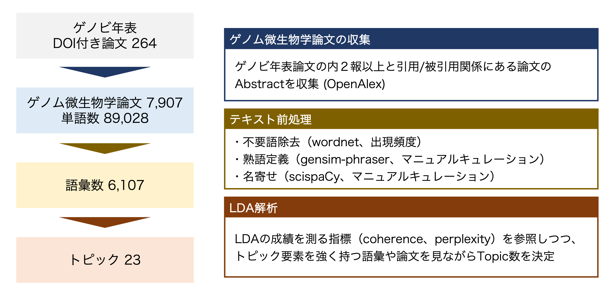
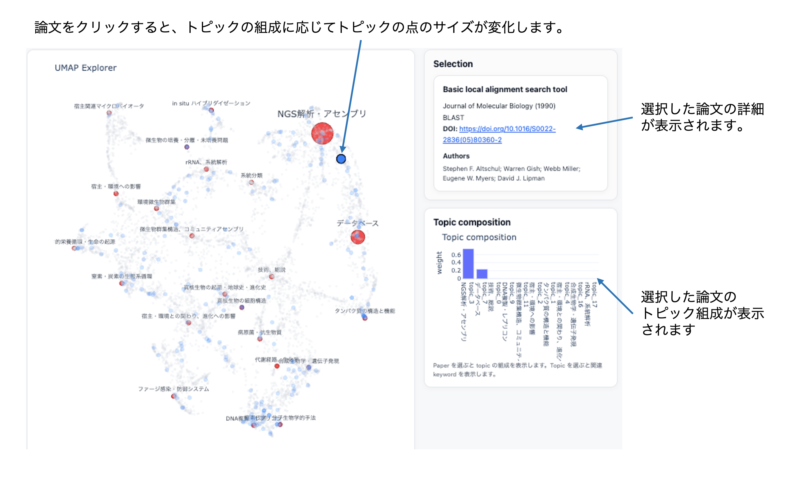

# ゲノム微生物学の地図

ゲノム微生物学という分野の構造を、可視化するためのアプリケーション。  
[こちら](https://genobinenpyovisualizer.onrender.com/)からインタラクティブな探索が可能です。

## 概要

学問の発展に伴い、ゲノム微生物学という分野は細分化が進み、  
その全体像を把握すること、それぞれの分野間の関係性を理解することは困難になってきています。  
さらに学際化が進み、個々の研究は単独の分野から成り立つものではなくなり、その曖昧な位置付けを把握することは困難です。

**ゲノム微生物学の地図**は、ゲノム微生物学分野における論文群をもとに、

- 分野の構造
- 研究トピックの分布
- 個々の論文の位置づけ

を2次元空間上に可視化するWebアプリケーションです。

論文群から**分野全体を俯瞰し、個々の研究の相対的な位置関係を表現**することを目的としています。

## データと手法

- データ
  - ゲノビ年表(ver.20250814)に収録された論文264報
  - それらと引用・被引用関係にある論文7,643報
  - 合計7,907報の論文のAbstract

- 手法
  - Abstractを入力としたトピックモデル（LDA）
  - 各論文のトピック組成を二次元空間に可視化（UMAP）

  

> [!NOTE]
> [ゲノビ年表](https://sites.google.com/view/genobiwakate/ゲノビ年表)は、日本ゲノム微生物学会若手の会が作成している、ゲノム微生物学における重要論文を整理した年表です。

## アプリの見方

- 赤の点：23のトピック。クリックすると、そのトピックを多く含む論文が大きく表示されます。
- 青の点：ゲノビ年表由来の論文。クリックすると、その論文が強く含むトピックが大きく表示されます。
- グレーの点：ゲノビ年表由来の論文と引用・被引用関係にある論文。

  

